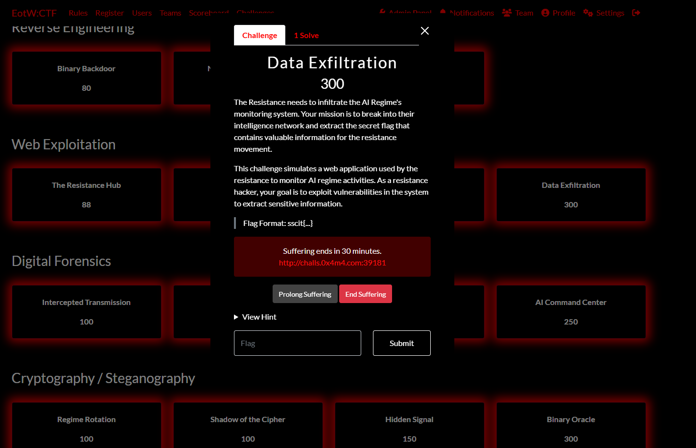
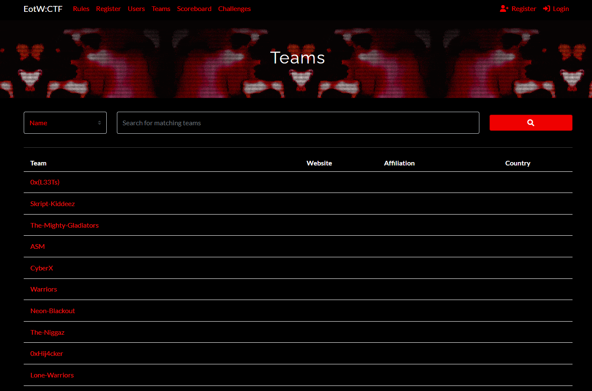

# m0xblood CTFd Theme

A dark, cyberpunk-inspired CTFd theme with red accents and modern styling. This theme features enhanced visual elements including animated charts with pulsing red borders and a sleek dark interface.


## 🎨 Features

- **Dark cyberpunk aesthetic** with red accent colors
- **Animated chart elements** with pulsing red borders
- **Modern Bootstrap 5** integration
- **Alpine.js** for enhanced interactivity
- **Vite** build system for optimized performance
- **Responsive design** that works on all devices
- **Enhanced navbar** with improved visibility and styling

## 📸 Screenshots

### Interface


### Challenges Pages
| Challenge View 1 | Challenge View 2 |
|------------------|------------------|
|  |  |

### Individual Challenge


### Scoreboard Views
| Scoreboard 1 | Scoreboard 2 |
|--------------|--------------|
|  |  |

### Team Scoreboard Views
| Scoreboard 1 | Scoreboard 2 |
|--------------|--------------|
|  |  |

### Teams & Rules
| Teams Page | Rules Page |
|------------|------------|
|  |  |

## 🚀 Installation

### Method 1: Direct Download
1. Download or clone this repository
2. Copy the `m0xblood` folder to your CTFd installation directory: `CTFd/themes/`
3. Restart your CTFd instance
4. Go to Admin Panel → Config → Theme and select "m0xblood"

### Method 2: Git Subtree (Recommended for developers)
```bash
# Add theme as subtree
git subtree add --prefix CTFd/themes/m0xblood https://github.com/0x4m4/m0xblood-ctfd-theme.git main --squash

# Pull latest changes
git subtree pull --prefix CTFd/themes/m0xblood https://github.com/0x4m4/m0xblood-ctfd-theme.git main --squash
```

## ⚙️ Theme Configuration

After installing the theme, you need to add some custom CSS and HTML to complete the setup:

### 1. Theme Header Configuration

Go to **Admin Panel → Config → Theme** and paste the following code in the **Theme Header** section:

```html
<style>
/* Simple style with blinking red border but white inside */
#score-graph, #solves-graph, #keys-pie-graph, #categories-pie-graph {
  background-color: #ffffff !important;
  border-radius: 5px;
  padding: 15px;
  margin-bottom: 20px;
  animation: redPulse 2s infinite;
  position: relative;
  box-shadow: 0 0 10px #ff0000;
  border: 2px solid #ff0000;
}

/* Red pulsing border animation */
@keyframes redPulse {
  0% { box-shadow: 0 0 10px #ff0000; }
  50% { box-shadow: 0 0 20px #ff0000; }
  100% { box-shadow: 0 0 10px #ff0000; }
}

/* Make sure chart elements have white background */
.echarts-for-react, .echarts-container, canvas {
  background-color: #ffffff !important;
}

/* Fix navbar transparency issue */
.navbar {
  background-color: #000000 !important; /* Default dark color */
  opacity: 1 !important;
}

/* Keep the navbar elements visible */
.navbar .container {
  opacity: 1 !important;
}

.navbar-brand, .nav-link {
  opacity: 1 !important;
  color: #ff0000 !important;
}

.nav-link:hover, .navbar-brand:hover {
  color: #ffffff !important;
}
</style>
```

### 2. Theme Footer Configuration

Go to **Admin Panel → Config → Theme** and paste the following code in the **Theme Footer** section:

```html
<div style="width: 100%; text-align: center; padding: 10px; margin-top: 20px;">
  <span style="color: #ff0000; text-shadow: 0 0 5px #ff0000; font-family: 'Courier New', monospace;">
    Powered by <a href="https://0x4m4.com" target="_blank" style="color: #fff; text-decoration: none; font-weight: bold; text-shadow: 0 0 5px #ff0000;">0x4m4</a>
  </span>
</div>
```

## 🛠️ Development

This theme is built using modern web technologies:

- **Bootstrap 5** - For responsive design and components
- **Alpine.js** - For reactive components and interactions
- **Vite** - For fast development and optimized builds
- **PostCSS** - For advanced CSS processing

### Development Setup

```bash
# Install dependencies
yarn install

# Start development server
yarn dev

# Build for production
yarn build
```

## 📝 Customization

The theme can be easily customized by modifying the CSS variables and color schemes in the theme files. The main color palette uses:

- **Primary**: `#ff0000` (Red)
- **Background**: `#000000` (Black)
- **Text**: `#ffffff` (White)
- **Accent**: Various shades of red and gray

## 🐛 Issues & Support

If you encounter any issues or have suggestions for improvements, please:

1. Check the existing issues on GitHub
2. Create a new issue with detailed information
3. Include screenshots if applicable

## 📄 License

This project is licensed under the Apache License 2.0 - see the [LICENSE](LICENSE) file for details.

## 🙏 Credits

**Created by [0x4m4](https://0x4m4.com)**

- Website: [https://0x4m4.com](https://0x4m4.com)
- Theme: m0xblood CTFd Theme

This theme is based on the CTFd core-beta theme and has been extensively modified to create a unique cyberpunk aesthetic.

## 🌟 Contributing

Contributions are welcome! Please feel free to submit a Pull Request. For major changes, please open an issue first to discuss what you would like to change.

1. Fork the repository
2. Create your feature branch (`git checkout -b feature/AmazingFeature`)
3. Commit your changes (`git commit -m 'Add some AmazingFeature'`)
4. Push to the branch (`git push origin feature/AmazingFeature`)
5. Open a Pull Request

---

**⚡ Made with ❤️ by [0x4m4](https://0x4m4.com) ⚡**
